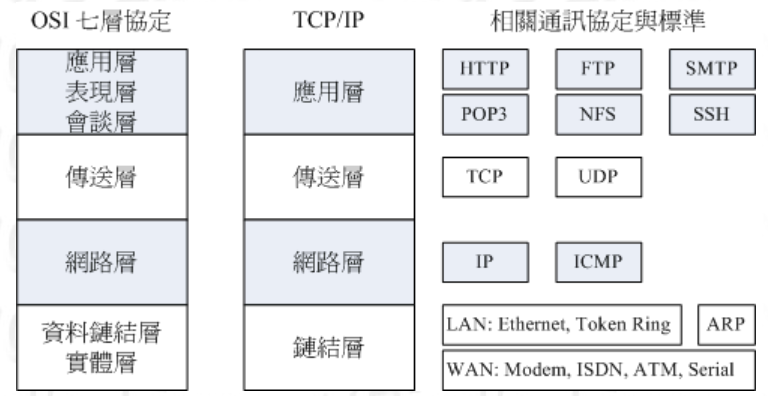
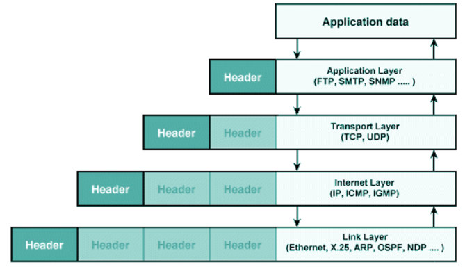
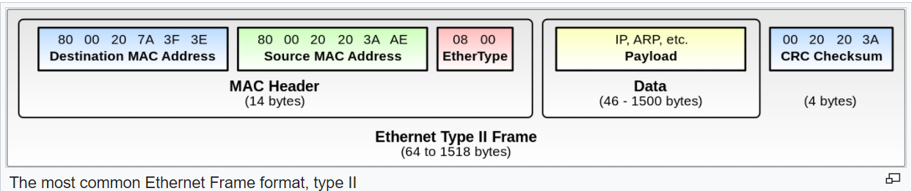
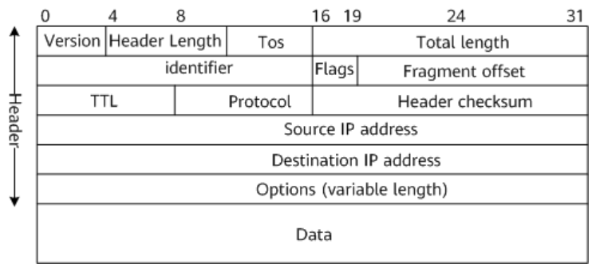
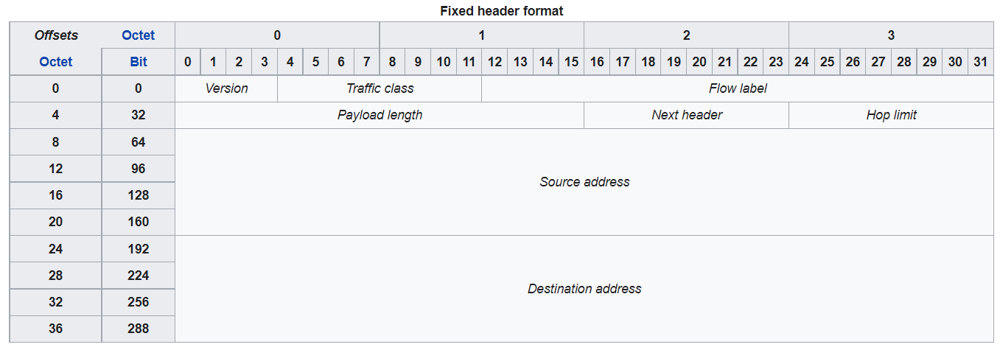
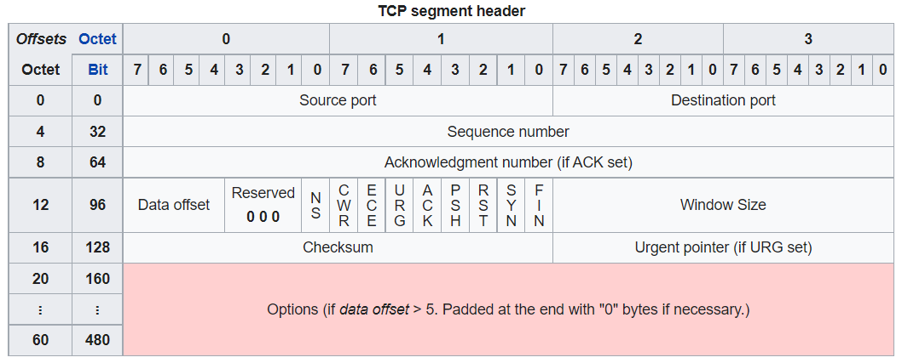

# Offloading Network Traffic Classification to Hardware
- youtube: https://www.youtube.com/watch?v=dANekxZZems

# Protocol Stack

# Ethernet Header
###### https://en.wikipedia.org/wiki/Ethernet_frame

###### https://en.wikipedia.org/wiki/EtherType
- 0x0800: IPv4
- 0x86DD: IPv6

# IPv4 Header

- Version
  - IPv4 is 4
- Header Length
  - minimum is value=5 = 5 x 4 bytes = 20 bytes
  - maximum is value=15 = 15 x 4 bytes = 60 bytes 
- Type of service (Tos)
- Total Length
  - the entire packet size in bytes, including header and data
  - minimum size is 20 bytes 
  - maximum is 65,535 bytes
- Identifier
  - the group of fragments of a single IP datagram
- Flags
  - bit 0: Reserved; must be zero
  - bit 1: Don't Fragment (DF)
  - bit 2: More Fragments (MF)
- Protocol
  - https://en.wikipedia.org/wiki/List_of_IP_protocol_numbers
  - TCP is 0x06
  - UDP is 0x11
  - IMCP is 0x01

# IPv6 Header

- Version
  - IPv6 is 6
- Payload length
  - The size of the payload in octets, including any extension headers (not including IPv6 header 40 bytes)
  - The length is set to zero when a Hop-by-Hop extension header carries a Jumbo Payload option

# TCP Header

- https://en.wikipedia.org/wiki/Transmission_Control_Protocol
- Data offset
  - Specifies the size of the TCP header in **32-bit words**
  - The minimum size header is 5 words and the maximum is 15 words
- Flags
  - CWR (Congestion window reduced)
- Window Size
  - The size of the receive window

# UDP Header

- Length
  - This field specifies the length in bytes of the UDP header and UDP data

# GSO/TSO/UFO/LRO/GRO
- https://blog.csdn.net/Rong_Toa/article/details/108748689#blogTitle1

# QoS (Quality of Service)
- good article
  - https://www.jannet.hk/quality-of-service-qos-router-zh-hant/
- Integrated Service (IntServ)
  - 預留緊急通道給高優先權封包
- Differentiated Service (DiffServ)
  - 只有發生 Congestion 的時候, 才實施交通管制
- Ingress (入口端)
- Outgree or egress (出口端)
  - Ingress inteface -> HW queue -> routing descision -> HW queue -> outgress interface
  - 遇到封包來不及處理, 通常都是解決 outgress 這邊的 HW queue
  - IP header 裡面有一個 DSCP (Differentiated Services Code Point)
