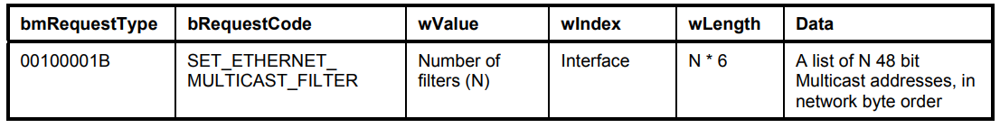
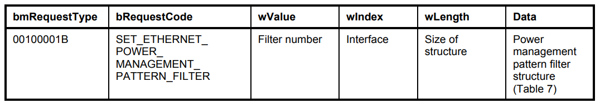

# ECM (Ethernet Control Model)
- Class Code
  - 02h: Communications Device Class
- Subclass Code
  - 06h: Ethernet Networking Control Model
- Protocol Code 
  - 00h: No class specific protocol required 

# Data Class interface
- shall have a minimum of two interface settings
  - The first setting (the default interface setting) includes no endpoints
  - the second setting includes a pair of endpoints (one IN, and one OUT) to exchange network traffic
- to recover the device to known states
  - the host will first select the default interface setting (with no endpoints) and then select the appropriate alternate interface setting

# Ethernet Networking Functional Descriptor

# Ethernet Statistics Capabilities

# Messages

# SetEthernetMulticastFilters

# SetEthernetPowerManagementPatternFilter

# PowerManagementPatternFilterStructure

# GetEthernetPowerManagementPatternFilter

# SetEthernetPacketFilter

# GetEthernetStatistic

# EthernetStatisticsFeatureSelectorCodes

# Notifications

# NotificationCodes

# INTERFACE ASSOCIATION DESCRIPTOR
    bLength: 8
    bDescriptorType: 0x0b (INTERFACE ASSOCIATION)
    bFirstInterface: 7
    bInterfaceCount: 2
    bFunctionClass: Communications and CDC Control (0x02)
    bFunctionSubClass: 0x06
    bFunctionProtocol: 0x00
    iFunction: 21

## INTERFACE DESCRIPTOR (7.0): class Communications and CDC Control
      bLength: 9
      bDescriptorType: 0x04 (INTERFACE)
      bInterfaceNumber: 7
      bAlternateSetting: 0
      bNumEndpoints: 1
      bInterfaceClass: Communications and CDC Control (0x02)
      bInterfaceSubClass: Ethernet Networking Control Model (0x06)
      bInterfaceProtocol: No class specific protocol required (0x00)
      iInterface: 18
### COMMUNICATIONS DESCRIPTOR
        bLength: 5
        bDescriptorType: 0x24 (CS_INTERFACE)
        Descriptor Subtype: Header Functional Descriptor (0x00)
        CDC: 0x0110
### COMMUNICATIONS DESCRIPTOR
        bLength: 5
        bDescriptorType: 0x24 (CS_INTERFACE)
        Descriptor Subtype: Union Functional Descriptor (0x06)
        Control Interface: 0x07
        Subordinate Interface: 0x08
### COMMUNICATIONS DESCRIPTOR
        bLength: 13
        bDescriptorType: 0x24 (CS_INTERFACE)
        Descriptor Subtype: Ethernet Networking Functional Descriptor (0x0f)
        MAC Address: 0x13
        Ethernet Statistics: 0x00000000
        Max Segment Size: 1514
        Number MC Filters: 0x0000
        Number Power Filters: 0
### ENDPOINT DESCRIPTOR
        bLength: 7
        bDescriptorType: 0x05 (ENDPOINT)
        bEndpointAddress: 0x89  IN  Endpoint:9
        bmAttributes: 0x03
        wMaxPacketSize: 16
        bInterval: 9
### SUPERSPEED ENDPOINT COMPANION DESCRIPTOR
        bLength: 6
        bDescriptorType: 0x30 (SUPERSPEED USB ENDPOINT COMPANION)
        bMaxBurst: 0
        bmAttributes: 0x00
        wBytesPerInterval: 16

## INTERFACE DESCRIPTOR (8.0): class CDC-Data
      bLength: 9
      bDescriptorType: 0x04 (INTERFACE)
      bInterfaceNumber: 8
      bAlternateSetting: 0
      bNumEndpoints: 0
      bInterfaceClass: CDC-Data (0x0a)
      bInterfaceSubClass: 0x00
      bInterfaceProtocol: No class specific protocol required (0x00)
      iInterface: 0
## INTERFACE DESCRIPTOR (8.1): class CDC-Data
      bLength: 9
      bDescriptorType: 0x04 (INTERFACE)
      bInterfaceNumber: 8
      bAlternateSetting: 1
      bNumEndpoints: 2
      bInterfaceClass: CDC-Data (0x0a)
      bInterfaceSubClass: 0x00
      bInterfaceProtocol: No class specific protocol required (0x00)
      iInterface: 20
### ENDPOINT DESCRIPTOR
        bLength: 7
        bDescriptorType: 0x05 (ENDPOINT)
        bEndpointAddress: 0x88  IN  Endpoint:8
        bmAttributes: 0x02
        wMaxPacketSize: 1024
        bInterval: 0
### SUPERSPEED ENDPOINT COMPANION DESCRIPTOR
        bLength: 6
        bDescriptorType: 0x30 (SUPERSPEED USB ENDPOINT COMPANION)
        bMaxBurst: 0
        bmAttributes: 0x00
        wBytesPerInterval: 0
### ENDPOINT DESCRIPTOR
        bLength: 7
        bDescriptorType: 0x05 (ENDPOINT)
        bEndpointAddress: 0x05  OUT  Endpoint:5
        bmAttributes: 0x02
        wMaxPacketSize: 1024
        bInterval: 0
### SUPERSPEED ENDPOINT COMPANION DESCRIPTOR
        bLength: 6
        bDescriptorType: 0x30 (SUPERSPEED USB ENDPOINT COMPANION)
        bMaxBurst: 0
        bmAttributes: 0x00
        wBytesPerInterval: 0

