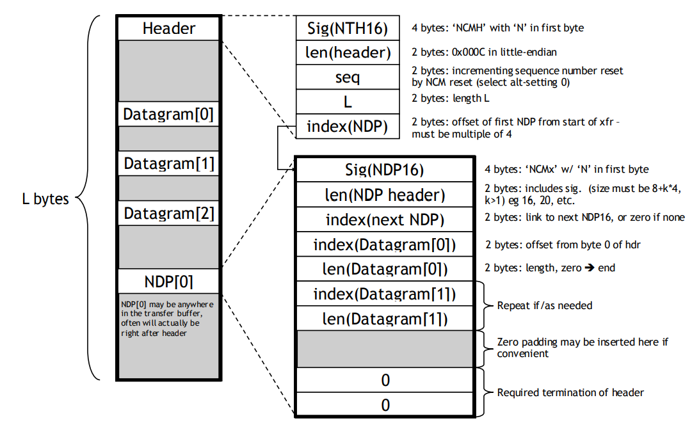
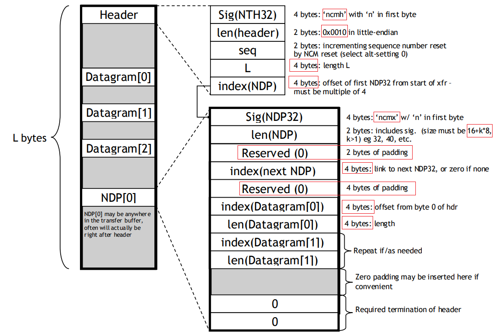

# NCM (Network Control Model)
###### The Network Control Model (NCM) Subclass is a protocol by which USB hosts and devices can efficiently exchange Ethernet frames.

# Terms
###### Network Control Model (NCM)
###### NCM Transfer Block (NTB)
###### NTB Header (NTH)
###### NCM Datagram Pointer (NDP)

# NTB layout details (16 bit)

# NTB layout details (32 bit)

# Reference
###### breakdown article: https://markdownlivepreview.com/
