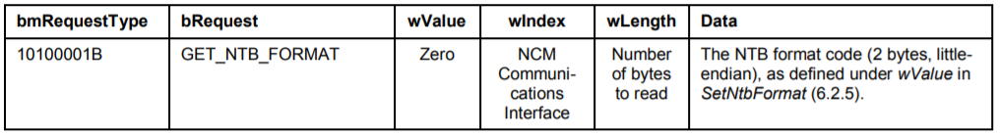
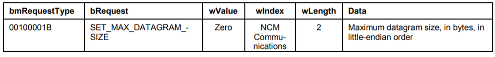

# NCM (Network Control Model)
###### The Network Control Model (NCM) Subclass is a protocol by which USB hosts and devices can efficiently exchange Ethernet frames.

# Terms
###### Network Control Model (NCM)
###### NCM Transfer Block (NTB)
###### NTB Header (NTH)
###### NCM Datagram Pointer (NDP)
# NTB layout details (16 bit)

# NTB layout details (32 bit)

# Datagram Formatting
###### The datagram always starts with a 14-byte [IEEE802.3] header, and then continues with the appropriate payload.
###### NDP16 or NDP32 must choose whether a CRC-32 will be appended to the payload.
###### NDP16.Sig="NCM0" if [IEEE802.3], no CRC-32
###### NDP16.Sig="NCM1" if [IEEE802.3], with CRC-32
###### NDP32.Sig=ncm0" if [IEEE802.3], no CRC-32
###### NDP32.Sig="ncm1" if [IEEE802.3], with CRC-32

# NCM Ethernet Frame Alignment
###### NCM allows a function to align transmitted payloads (the data following the Ethernet header in each datagram)
- Bulk IN
  - Offset % wNdpInDivisor == wNdpInPayloadRemainder
- Bulk OUT
  - Offset % wNdpOutDivisor == wNdpOutPayloadRemainder
###### The agent formatting a given NTB aligns the payload of each datagram by inserting padding

# NTB Maximum Sizes
- Bulk OUT
  - the device tells the host the size of NTB data structures
  - host should not send NTBs larger than the device can support
- Bulk IN
  - the host tells the device the size of NTB data structures
  - device should not send NTBs larger than the host can support
# NTB format support
- 16-bit NTB structures is mandatory
- 32-bit NTB structures is optional
# Ethernet Frame Datagram Maximum Size
- the device tells the host wMaxSegmentSize e in the Ethernet Networking Functional Descriptor
- the host shall not select a size larger than the device can support
- four-byte CRCs are not included in the maximum size
# Null NCM Datagram Pointer Entries
- Receivers shall process datagram pointer entries sequentially from the first entry in the NTB
# Class-Specific Codes
- NCM Communications Interface Subclass Code (bInterfaceSubClass)
  - 0Dh (Network Control Model)
- NCM Communications Interface Protocol Code (bInterfaceProtocol)
  - 00h (No encapsulated commands / responses)
  - FEh (OEM defined)
- NCM Data Class Protocol Code
  - 01h (Network Control Model)
- NCM Functional Descriptor Code
  - 1Ah (NCM Functional Descriptor)

# NCM Function Descriptor

# Data Interface Descriptor
- have two alternate settings
  - alternate setting 0
    - no endpoints and therefore no networking traffic can be exchanged
  - alternate setting 1
    - used for normal operation, and shall include one bulk IN endpoint and one bulk OUT endpoint

# NCM Control Message

# GetNtbParameters

- All NCM functions shall support 16-bit NTBs
- If 32-bit NTBs are supported, then GetNtbFormat and SetNtbFormat must be supported

# GetNetAddress

- the host should set wLength to at least 6

# SetNetAddress

# GetNtbFormat

- host should set wLength to at least 2

# SetNtbFormat

# GetNtbInputSize

- the host should set wLength to at least 4

# SetNtbInputSize

- This request selects the maximum size of NTB that the device is permitted to send to the host

# GetMaxDatagramSize

- the host should set wLength to at least 2

# SetMaxDatagramSize

- The host shall select a size that is at least 1514
- and no larger than the maximum size permitted by the function, according to the value given by wMaxSegmentSize in the Ethernet Networking Functional Descriptor

# GetCrcMode

- the host should set wLength to at least 2

# SetCrcMode

# NCM Notifications

# Reference
###### breakdown article: https://markdownlivepreview.com/
