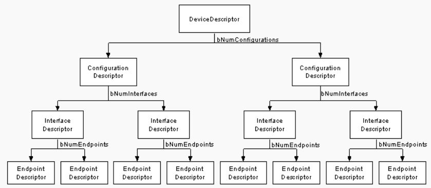
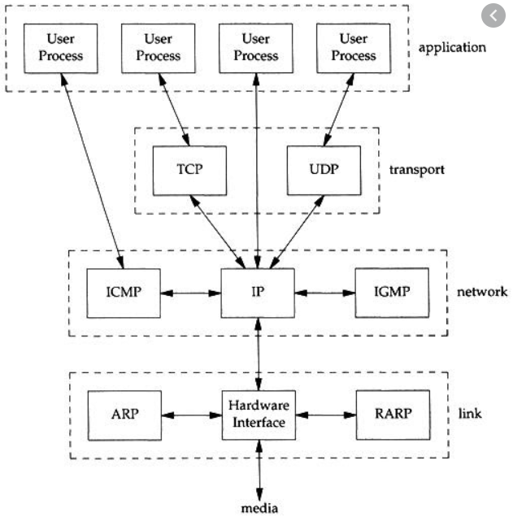
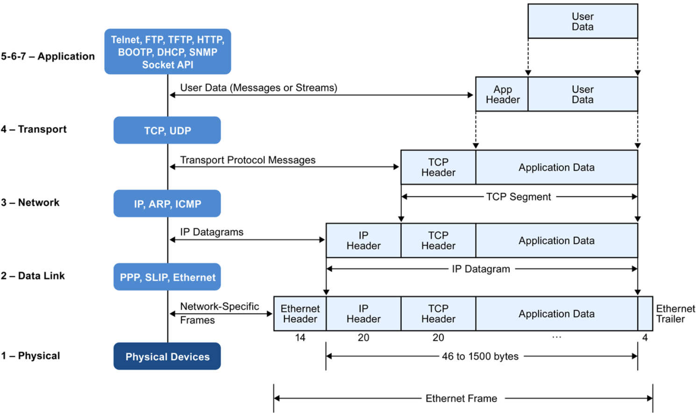

# USB Descriptors

### DEVICE DESCRIPTOR
- bLength: 18
- bDescriptorType: 0x01 (DEVICE)
- bcdUSB: 0x0200
- bDeviceClass: Device (0x00)
- bDeviceSubClass: 0
- bDeviceProtocol: 0 (Use class code info from Interface Descriptors)
- bMaxPacketSize0: 64
- idVendor: HTC (High Tech Computer Corp.) (0x0bb4)
- idProduct: Desire HD (modem mode) (0x0ffe)
- bcdDevice: 0x0404
- iManufacturer: 1
- iProduct: 2
- iSerialNumber: 3
- bNumConfigurations: 1

### CONFIGURATION DESCRIPTOR
- bLength: 9
- bDescriptorType: 0x02 (CONFIGURATION)
- wTotalLength: 75
- bNumInterfaces: 2
- bConfigurationValue: 1
- iConfiguration: 4
- Configuration bmAttributes: 0x80  NOT SELF-POWERED  NO REMOTE-WAKEUP
- bMaxPower: 250  (500mA)

### INTERFACE ASSOCIATION DESCRIPTOR (IAD)
- bLength: 8
- bDescriptorType: 0x0b (INTERFACE ASSOCIATION)
- bFirstInterface: 0
- bInterfaceCount: 2
- bFunctionClass: Wireless Controller (0xe0)
- bFunctionSubClass: 0x01
- bFunctionProtocol: 0x03
- iFunction: 7
  - Class (0xe0), SubClass (0x01), Protocol (0x03) is RNDIS
  - https://www.usb.org/defined-class-codes#anchor_BaseClassE0h
  - IAD is used for association two or more interfaces together as one function (ex: RNDIS)
    - assoicate wireless controller and CDC-Data

### INTERFACE DESCRIPTOR (0.0): class Wireless Controller
- bLength: 9
- bDescriptorType: 0x04 (INTERFACE)
- bInterfaceNumber: 0
- bAlternateSetting: 0
- bNumEndpoints: 1
- bInterfaceClass: Wireless Controller (0xe0)
- bInterfaceSubClass: 0x01
- bInterfaceProtocol: 0x03
- iInterface: 5
  - Class (0xe0), SubClass (0x01), Protocol (0x03) is RNDIS
  - https://www.usb.org/defined-class-codes#anchor_BaseClassE0h

#### ENDPOINT DESCRIPTOR
- bLength: 7
- bDescriptorType: 0x05 (ENDPOINT)
- bEndpointAddress: 0x81  IN  Endpoint:1
- bmAttributes: 0x03
- wMaxPacketSize: 8
- bInterval: 9
  - for device to notify the host RNDIS control message is ready to be read

### INTERFACE DESCRIPTOR (1.0): class CDC-Data
- bLength: 9
- bDescriptorType: 0x04 (INTERFACE)
- bInterfaceNumber: 1
- bAlternateSetting: 0
- bNumEndpoints: 2
- bInterfaceClass: CDC-Data (0x0a)
- bInterfaceSubClass: 0x00
- bInterfaceProtocol: No class specific protocol required (0x00)
- iInterface: 6
  - https://www.usb.org/defined-class-codes#anchor_BaseClass0Ah

### ENDPOINT DESCRIPTOR
- bLength: 7
- bDescriptorType: 0x05 (ENDPOINT)
- bEndpointAddress: 0x8e  IN  Endpoint:14
- bmAttributes: 0x02
- wMaxPacketSize: 512
- bInterval: 0
  - device to host data endpoint
  - protocol stack over this interface is
    - RNDIS header, Ethernet header, IP header, TCP/UDP/ICMP
    - 
    - 

### ENDPOINT DESCRIPTOR
- bLength: 7
- bDescriptorType: 0x05 (ENDPOINT)
- bEndpointAddress: 0x0f  OUT  Endpoint:15
- bmAttributes: 0x02
- wMaxPacketSize: 512
- bInterval: 0
  - host to device data endpoint
