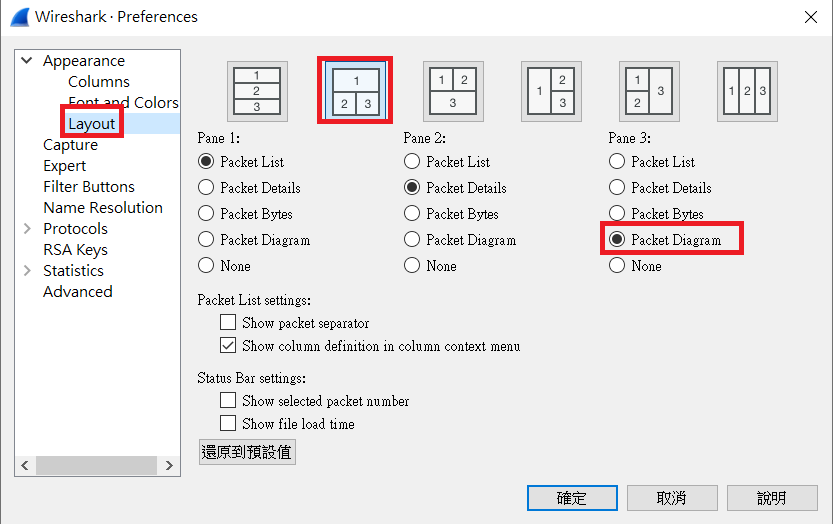
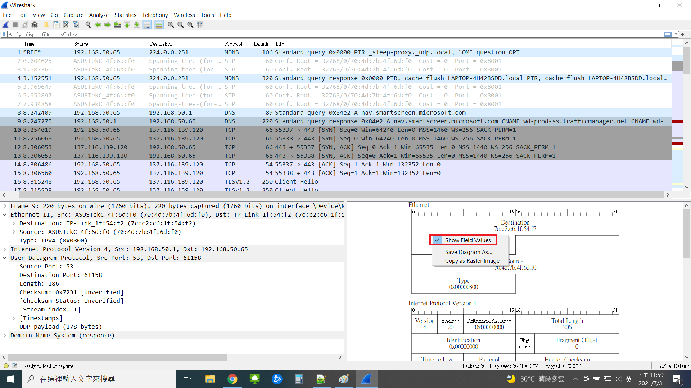

# Wireshark
### Show Delta Time
###### Edit -> Preferences -> Appearance -> Columns -> Add -> Delta Time Displayed
### Coloring Rule
###### View -> Coloring Rule -> Add -> Filter: tcp.flags.syn==1
### Show Field Values
###### Edit -> Preferences 

